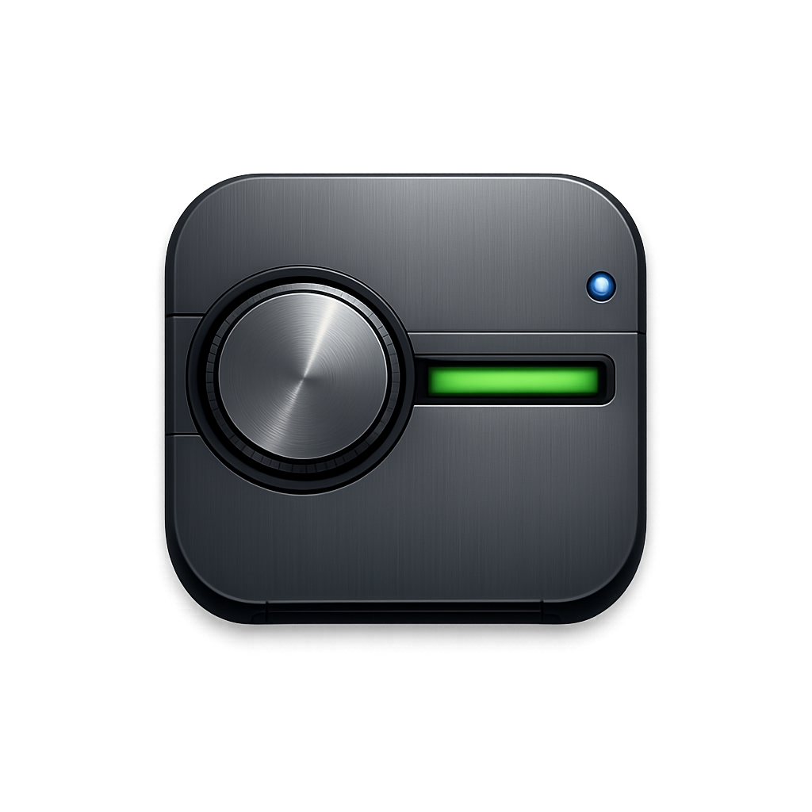

<p align="center">
  
</p>

# Soft Club UI

Soft Club UI is a reusable React component library shaped by late-90s Sony-adjacent soft club graphics: dark glass, phosphor green, cold blue, smoke, blurred photography, underground transit grids, concrete interiors, and restrained cyber/Y2K technology.

The package is publish-ready as `@cobanov/soft-club-ui`.

## Demo

The component catalog is deployed to GitHub Pages:

[soft-club-ui demo](https://cobanov.github.io/soft-club-ui/)

The same deployment also includes a product-style demo website built with the library:

[soft-club-ui demo website](https://cobanov.github.io/soft-club-ui/demo/)

## Install

```sh
pnpm add @cobanov/soft-club-ui @cobanov/soft-club-tokens
```

Import the component styles once in your app:

```tsx
import "@cobanov/soft-club-ui/styles.css";
```

Use components from the package:

```tsx
import { Badge, Button, Card, CardContent, CardHeader, CardTitle } from "@cobanov/soft-club-ui";

export function Example() {
  return (
    <Card>
      <CardHeader>
        <CardTitle>Room A3</CardTitle>
      </CardHeader>
      <CardContent>
        <Badge variant="green">Glass</Badge>
        <Button>Sync channel</Button>
      </CardContent>
    </Card>
  );
}
```

## Install single components with the shadcn CLI

Soft Club UI also ships a shadcn-compatible registry. You can copy any component into your project, own the source, and edit it freely. No custom CLI needed, the official `shadcn` CLI does the work.

Add a component by URL:

```sh
npx shadcn@latest add https://cobanov.github.io/soft-club-ui/r/sheet.json
```

Or register the namespace once in your `components.json`:

```json
{
  "registries": {
    "@soft-club": "https://cobanov.github.io/soft-club-ui/r/{name}.json"
  }
}
```

Then install by name:

```sh
npx shadcn@latest add @soft-club/sheet
```

The CLI resolves everything the component needs: sibling components it imports, shared hooks and utilities, npm dependencies, and the `base` item with the design tokens and stylesheet. Files land in your project under `components/soft-club/`, `hooks/soft-club/`, `lib/soft-club/`, and `styles/`.

After the first install, import the stylesheet once in your global CSS and pick a theme on `<html>`:

```css
@import "./styles/soft-club.css";
```

```html
<html data-sc-theme="night-city">
```

Themes: `green` (default), `blue`, `orange`, `night-city`.

The registry index lives at [`registry.json`](https://cobanov.github.io/soft-club-ui/registry.json) and is generated from the component sources by `scripts/build-registry.mjs` on every docs build. Run `pnpm build:registry` to regenerate it locally.

## Packages

- `packages/ui`: React components, Radix UI wrappers, TypeScript exports, and component CSS.
- `packages/tokens`: CSS variables for colors, typography, spacing, radius, borders, shadows, and motion.
- `apps/docs`: Vite demo app and Storybook host.

## Scripts

```sh
pnpm dev
pnpm build
pnpm build:registry
pnpm storybook
pnpm lint
pnpm typecheck
```

## Design Philosophy

Soft Club UI is not McBling, not bright disco Y2K, and not generic SaaS dark mode. It is more mature and urban: black glass, desaturated earth tones, green translucent technology, cold blue lighting, Helvetica-style typography, thin technical borders, low-radius surfaces, and subtle scanline/noise texture.

The components stay accessible and practical. Radix UI handles interaction semantics, exported components support `className` overrides, and all visual decisions are token-based.

## Inspiration

The expanded performative surface set was informed by the MIT-licensed [`vorpus/performativeUI`](https://github.com/vorpus/performativeUI) component catalog, then rewritten for Soft Club's late-90s green-glass design language.

## v0 Components

- Button
- Input
- Textarea
- Card
- Badge
- Tabs
- Dialog
- Dropdown Menu
- Popover
- Toast
- AsciiHero
- AuroraField
- NodeGrid
- GlassPanel
- MockConsole
- TokenStream
- ChatBubble
- ChatDock
- PromptBox
- BeforeAfter
- WordRoll
- StatCounter
- SignalMarquee
- StatusIndicator
- StickyBanner
